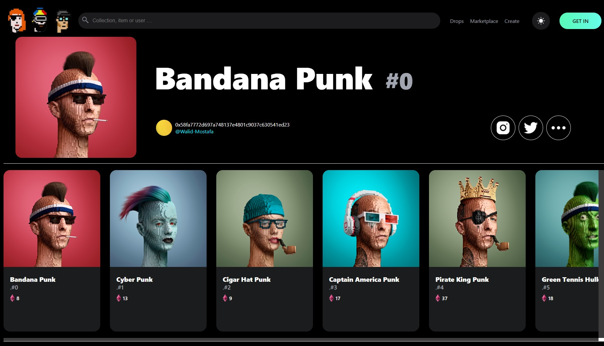

- Overview:
  - [NFT Project Overview](#the-challenge)
  - [https://wella4life.github.io/nft-project/](#links)
  - 

 - Users should be able to:
   - View the optimal layout for the site depending on their device's screen size
   - Navigate between different nfts with scrolling and/or clicking

 - What I Learned:
   - First project with Javascript
   - First project with JSX
   - First project with React
   - First project with Thirdweb
   - First project with opensea
   - First project with metaface
   - First project including nfts and blockchain 
